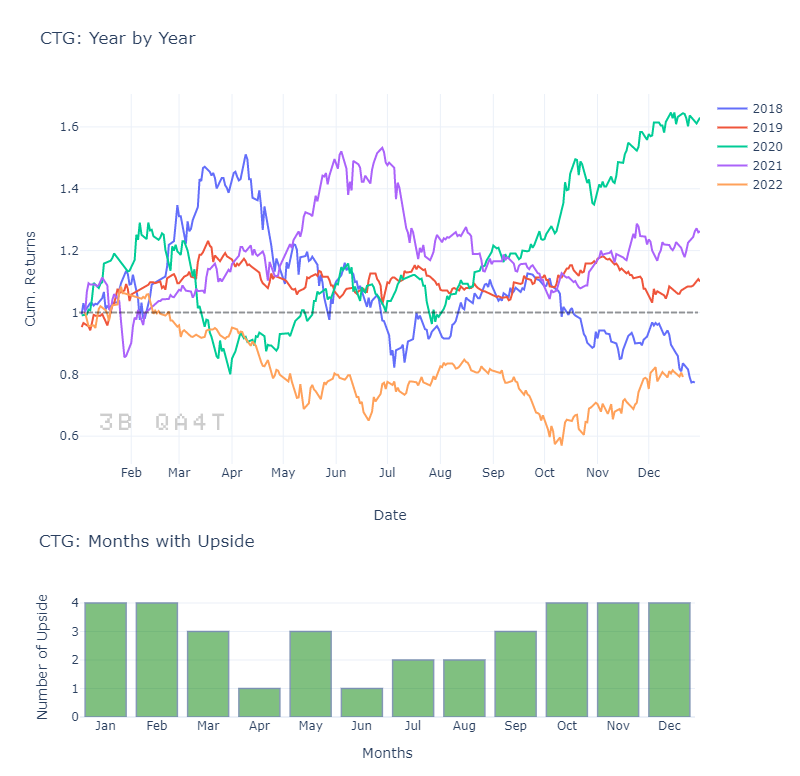

# Phân tích tính chu kỳ (hiệu ứng mùa vụ) của một vài cổ phiếu ngân hàng 5 năm qua
Seasonal Effect on Bank Stocks last 5 years
## Cycle & Season
Trong thị trường chứng khoán, khi nói đến chu kỳ người ta thường hay nghĩ đến chu kỳ giá cổ phiếu theo lý thuyết Đao, hoặc chu kỳ (cyclical stock) do tác động bởi các yếu tố vĩ mô hay các giai đoạn phát triển của nền kinh tế. Các chu kỳ kiểu này là một vòng tuần hoàn được lặp lại sau một thời gian đã trải qua hết các pha nhỏ bên trong (cycle). Chúng là những cấu trúc có tính toàn bộ (universal) giống như mọi sự vận động khác trên thế giới (chu trình thủy quyển, vòng đời, …).

Chu kỳ muốn đề cập đến trong bài viết này nói chính xác hơn là tính mùa vụ (seasonal), là những hình mẫu thường xuất hiện ở một thời điểm cố định nào đó trong những khoảng thời gian xem xét như nhau. Như ở thị trường chứng khoán Châu Âu và Mỹ người ta thường có câu “Sell in May and go away”. Hay ở thị trường VN cũng có một vài thống kê cho thấy thứ Hai hàng tuần thị trường thường hay giảm nhưng lại tăng mạnh vào thứ Tư. Đây là kiểu phân tích hiệu ứng mùa vụ (seasonal effect), cách làm này dựa vào dữ liệu để tìm ra các biến động có tính lặp đi lặp lại và sử dụng các kết quả như một công cụ gia tăng trợ giúp cho việc đưa ra quyết định.

Hãy thử sử dụng phương pháp này để phân tích tính chu kỳ của cổ phiếu CTG (VietinBank) trong 5 năm qua bằng đồ thị dưới đây:

<br>
Biểu đồ trên thể hiện sự biến động của cổ phiếu CTG theo từng năm riêng biệt. Nhìn chung, hầu hết các năm giá cổ phiếu đều tăng trưởng so với thời điểm ban đầu trừ 2018 & 2022.

Để dễ dàng nhận ra tính chu kỳ hãy xem xét theo từng tháng, ở đây sự lặp đi lặp lại về mặt tăng trưởng sẽ xuất hiện: tháng Một và tháng Hai hoặc ba tháng cuối năm giá cổ phiếu thường hay có xu hướng tăng (4 lần trong 5 năm). Trong khi đó, các tháng thuộc quý II, giá cổ phiếu thường suy giảm.

## Chu kỳ một số cổ phiếu ngành ngân hàng
Để hiểu rõ hơn về tính chu kỳ của một cổ phiếu ta hãy đặt nó bên cạnh các cổ phiếu khác cùng ngành, như vậy các kết quả sẽ giúp xác nhận lẫn nhau với độ tin cậy cao hơn.

Tôi sử dụng số liệu của 15 cổ phiếu ngành ngân hàng có thời gian niêm yết lớn hơn 5 năm để thống kê. Kết quả được tổng hợp ở bảng dưới đây. Trong bảng này thể hiện số lần xuất hiện của tháng mà giá cổ phiếu đó tăng trong 5 năm qua, cột cuối cùng bên phải là tổng của số lần xuất hiện của tất cả các cổ phiếu trong tháng đó:

<br>
Có thể đưa ra vài nhận xét từ kết quả trên:

- Tính tương quan của các cổ phiếu ngân hàng tương đối cao: cùng tăng hoặc cùng giảm
- Hai tháng cuối năm các cổ phiếu ngân hàng tăng trưởng mạnh mẽ nhất
- Khoảng thời gian giữa năm giá thường bị rớt
- Hiệu ứng Tết (tháng Hai) cũng làm cho giá cổ phiếu ngành ngân hàng tăng mạnh
- Tháng Tám thường có một nhịp tăng ngắn hạn kéo dài một phần qua tháng Chín
- Các cổ phiếu đầu ngành thể hiện sự dẫn dắt khi luôn đi đầu ở các giai đoạn tăng trưởng

Tuy nhiên, các kết quả thống kê cũng không phản ánh được hết những câu chuyện riêng của từng cổ phiếu, một số cổ phiếu vẫn có sự chuyển động ngược hướng so với phần còn lại (mặc kệ sự đời).

Happy Investing!
<br>
\***
<br>
*Ghi chú: Số liệu thống kê chỉ mang tính nghiên cứu.*
## Code
```python
summary = pd.DataFrame()
for ticker in tickers:
  months = pd.DataFrame({ticker:[0,0,0,0,0,0,0,0,0,0,0,0]}, 
                      index=['Jan', 'Feb', 'Mar', 'Apr', "May", 'Jun', 'Jul', "Aug", 'Sep', 'Oct', "Nov", 'Dec'])
  for i in ['2018','2019','2020','2021','2022']:
    df = ticker_prices[ticker][i:i].resample('M').apply(lambda ser: ser.iloc[-1,]) > ticker_prices[ticker][i:i].resample('M').apply(lambda ser: ser.iloc[0,])
    months[ticker] = months[ticker] + df.values
  summary = pd.concat([summary, months], axis=1)
```
